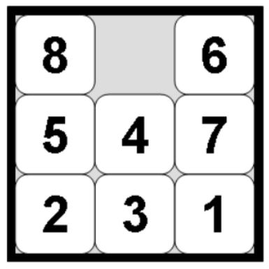

### Assignment01 README

[Assignment instructions](A01.pdf)

#### Abstract Overview

Created a TileBoard class and Board class for representing n-puzzles 

- [board.py](basicsearch_lib/board.py) 
- [boardtypes.py](basicsearch_lib/boardtypes.py)

##### For Example: 
**TileBoard(n, force_state=None)** – Creates an n-puzzle of size n.  
Example TileBoard(8) creates the 8-puzzle shown above

#### Checkout:
- [Project Code](basicsearch_lib/)
-  The [driver.py](basicsearch_lib/driver.py) for using interacting with the implementation. Can you solve the puzzle?
- [Code](basicsearch_lib/gettingcomfortable.py) that got me up to speed with  Lists, List comprehension, Iterables, String Formatting
- [Research done alongside this assignment](Research/)
